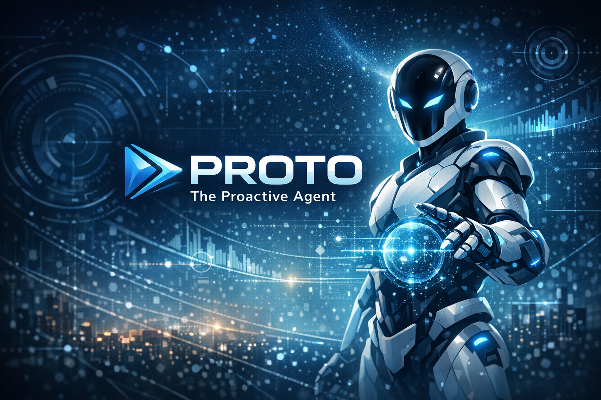
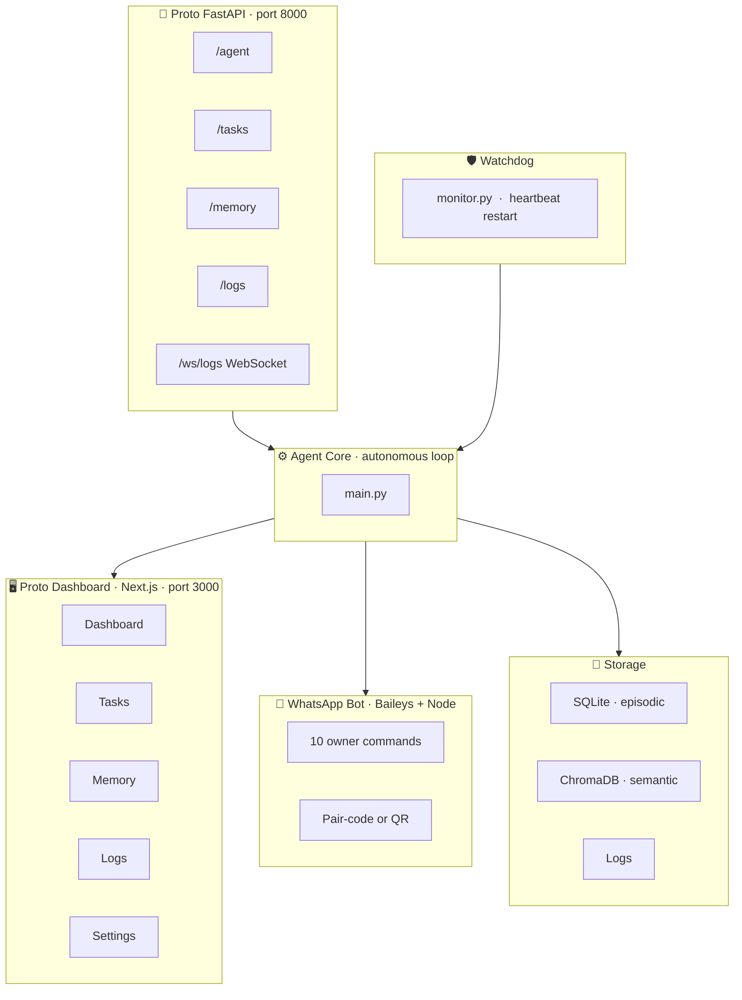

<div align="center">

<!-- HERO -->
<br/>



<br/>

### `THE PROACTIVE AGENT`

*Autonomous. Reliable. Future-ready.*

<br/>

[](https://python.org)
[](https://nodejs.org)
[](https://fastapi.tiangolo.com)
[](https://nextjs.org)

[](./LICENSE)
[](#)
[](#configuration)
[](#)

<br/>

> **Proto is not a chatbot.**
> You give it a goal. It plans. It acts. It remembers. It reports.
> All on your machine. Always running.

<br/>

</div>

---

## ◈ What is Proto?

Proto is a **self-hosted autonomous AI agent** — a background process that never sleeps. Drop it a long-lived goal once, and it handles the rest: decomposing, deciding, executing, and recovering on its own, with zero cloud dependency.

```
You  ──→  [ Goal ]  ──→  Proto Plans  ──→  Proto Acts  ──→  Proto Reports
                               ↑                                    ↓
                          Remembers past                    Dashboard + WhatsApp
                          failures & wins
```

Because everything runs on **your hardware**, your data never leaves your machine. Use a local Ollama model — or point Proto at any OpenAI-compatible endpoint with one environment variable.

---

## ◈ The Loop

<table>
<tr>
<td width="60">

**`01`**

</td>
<td>

### Decompose

Given a long-lived goal, Proto breaks it into an actionable task hierarchy using a **Hierarchical Task Network (HTN) planner**.

</td>
</tr>
<tr>
<td>

**`02`**

</td>
<td>

### Decide

It consults the configured LLM + its own **episodic memory** to pick the next safe, sensible action — steering around moves that failed before.

</td>
</tr>
<tr>
<td>

**`03`**

</td>
<td>

### Execute

Actions run through a **cross-platform sandboxed tool registry** that screens every shell command and file operation before it fires — covering both Windows and POSIX destructive patterns.

</td>
</tr>
<tr>
<td>

**`04`**

</td>
<td>

### Remember

Outcomes are written to **SQLite** (episodic) and **ChromaDB** (semantic vector store). Proto stops repeating bad decisions because it genuinely remembers them.

</td>
</tr>
<tr>
<td>

**`05`**

</td>
<td>

### Report

A **real-time Next.js dashboard** streams live logs over WebSocket. A **WhatsApp bot** (Baileys) lets you query, steer, pause, or redirect from your phone with `!` commands.

</td>
</tr>
<tr>
<td>

**`06`**

</td>
<td>

### Recover

A **watchdog process** monitors the agent's heartbeat. If it goes stale, Proto is restarted within seconds — with exponential back-off.

</td>
</tr>
</table>

---

## ◈ Architecture



> Every process is **independent**. The dashboard or WhatsApp bot can be down — the agent keeps thinking. The agent can crash — the watchdog brings it back.

---

## ◈ Feature Highlights

| | Feature | Detail |
|---|---|---|
| 🔀 | **Three decoupled processes** | Agent core · FastAPI `:8000` · Next.js `:3000` · WhatsApp bot |
| 🧠 | **BYO-LLM** | `LLM_PROVIDER=ollama` or `openai` — one env variable swap |
| 💾 | **Dual memory** | SQLite episodes + ChromaDB vector recall (degrades gracefully) |
| 🛡️ | **Cross-platform sandbox** | Blocks `rm -rf /`, `del /f`, `format`, fork-bombs, and more |
| ♻️ | **Watchdog recovery** | Heartbeat monitor with exponential back-off restarts |
| ⚡ | **Real-time dashboard** | WebSocket log stream, goal injection, pause/resume, memory pruning |
| 📱 | **WhatsApp control** | 10 owner-only commands from your phone |
| 🔧 | **Service installers** | `install_service.bat` (NSSM) · `install_service.sh` (systemd) |
| 📦 | **Portable** | Clone anywhere, two `install` commands, edit `.env` — done |

---

## ◈ Prerequisites

```
Python 3.11+          →  agent core, FastAPI backend, watchdog
Node.js 18+ / npm     →  dashboard + WhatsApp bot
Ollama (recommended)  →  local inference, zero data egress
```

Pull a model (or swap for any OpenAI-compatible endpoint):

```bash
ollama pull qwen2.5:14b
```

> **Windows only:** [NSSM](https://nssm.cc) on `PATH` for the auto-start service installer.
> **Linux only:** systemd + `sudo` for the service installer.

---

## ◈ Quick Start

```bash
# 1 — Clone and enter
git clone https://github.com/ojas-mohbansi/proto.git
cd proto

# 2 — Python dependencies
python -m pip install -r requirements.txt

# 3 — Dashboard dependencies
cd dashboard && npm install && cd ..

# 4 — WhatsApp bot dependencies
cd whatsapp && npm install && cd ..

# 5 — Configure
cp .env.example .env
#    ↳ set LLM_PROVIDER, OLLAMA_MODEL, WA_OWNER_NUMBER, etc.
```

Then start each process in its own terminal:

```bash
python main.py "Maintain and improve yourself."   # agent core
python start_api.py                               # REST API  →  :8000
cd dashboard && npm run dev                       # dashboard →  :3000
cd whatsapp  && node index.js                     # WhatsApp bot
```

API docs auto-generated at **[http://localhost:8000/docs](http://localhost:8000/docs)**

---

## ◈ Configuration

All config lives in **`.env`**. Key variables:

| Variable | Default | Notes |
|---|---|---|
| `LLM_PROVIDER` | `ollama` | `ollama` or `openai` |
| `OLLAMA_MODEL` | `qwen2.5:14b` | Any pulled Ollama model |
| `OLLAMA_BASE_URL` | `http://localhost:11434` | |
| `OPENAI_MODEL` | `gpt-4o-mini` | Used when `LLM_PROVIDER=openai` |
| `OPENAI_BASE_URL` | `https://api.openai.com/v1` | Any OpenAI-compatible URL |
| `OPENAI_API_KEY` | *(empty)* | Required for cloud providers |
| `AGENT_HOME` | project dir | Base for `memory/`, `state/`, `logs/` |
| `CHECKPOINT_INTERVAL_SECONDS` | `300` | State persistence frequency |
| `WATCHDOG_INTERVAL_SECONDS` | `30` | Heartbeat check frequency |
| `WA_OWNER_NUMBER` | *(empty)* | `<digits>@s.whatsapp.net` |
| `WA_PREFIX` | `!` | Command prefix in WhatsApp |

See [`.env.example`](.env.example) for the full list.

---

## ◈ Installing as Services

<details>
<summary><strong>🪟 Windows — NSSM</strong></summary>
<br/>

Run as **Administrator**:

```bat
install_service.bat
```

Installs `ProtoAgent` · `ProtoWatchdog` · `ProtoAPI` · `ProtoWhatsApp` as Windows services.

For the dashboard: `cd dashboard && npm run build && npm run start`
(or add it as a fifth NSSM service manually).

</details>

<details>
<summary><strong>🐧 Linux — systemd</strong></summary>
<br/>

```bash
sudo ./install_service.sh install     # install + start all four units
sudo ./install_service.sh status      # check status
sudo ./install_service.sh uninstall   # remove
```

Installs `proto-api` · `proto-agent` · `proto-watchdog` · `proto-whatsapp`.

For the dashboard: `cd dashboard && npm run build && npm run start`

</details>

---

## ◈ WhatsApp Setup

1. Set `WA_OWNER_NUMBER` in `.env` — full international number **without `+`**, suffixed with `@s.whatsapp.net`:

   ```
   WA_OWNER_NUMBER=919876543210@s.whatsapp.net
   ```

2. *(Optional)* Paste a base64 session string into `WA_SESSION_ID` to skip QR pairing.

3. Otherwise: run `node whatsapp/index.js` → scan the QR in WhatsApp → **Linked Devices** → stop and reinstall as service.

### Commands

| Command | Usage | Description |
|---|---|---|
| `!status` | `!status` | Show agent status |
| `!tasks` | `!tasks [limit]` | List tasks (default 10) |
| `!tree` | `!tree` | Print the full task tree |
| `!goal` | `!goal <text>` | Set a new top-level goal |
| `!logs` | `!logs [n]` | Last *n* log lines (cap 30) |
| `!memory` | `!memory <query>` | Search agent memory |
| `!pause` | `!pause` | Pause the agent |
| `!resume` | `!resume` | Resume the agent |
| `!stats` | `!stats` | Combined agent / task / memory stats |
| `!help` | `!help` | List all commands |

---

## ◈ Dashboard

`http://localhost:3000` — dark, monospace, GitHub-styled.

| Tab | What you get |
|---|---|
| **Dashboard** | Live status cards · current goal & task · LLM status · pause/resume · real-time WebSocket log stream |
| **Tasks** | Full task table with filters · add / edit / delete · rendered task tree |
| **Memory** | Searchable episodic memory · action/result drill-down · prune-old action |
| **Logs** | File picker · configurable line count · downloadable as `.txt` |
| **Settings** | Read-only config view · goal injection form · pause/resume |

---

## ◈ Project Layout

```
proto/
├── README.md                ← you are here
├── .env.example             ← copy to .env and configure
├── requirements.txt
│
├── main.py                  ← autonomous loop entrypoint
├── start_api.py             ← FastAPI launcher
├── config.py                ← env-driven config
│
├── install_service.bat      ← Windows service installer (NSSM)
├── install_service.sh       ← Linux service installer (systemd)
│
├── llm/                     ← Ollama + OpenAI-compatible client + prompts
├── memory/                  ← SQLite episodic + ChromaDB semantic managers
├── planner/                 ← HTN planner + task schema
├── tools/                   ← cross-platform sandbox + tool registry
├── watchdog/                ← heartbeat monitor
├── webui/                   ← FastAPI app + routers
│
├── dashboard/               ← Next.js dashboard (Tailwind CSS)
└── whatsapp/                ← Baileys bot + 10 owner commands
```

---

## ◈ Troubleshooting

<details>
<summary><strong>Agent not starting</strong></summary>

Confirm Ollama is reachable:

```bash
curl http://localhost:11434/api/tags
```

Or verify your `OPENAI_API_KEY` is set and valid.

</details>

<details>
<summary><strong>Dashboard shows "offline"</strong></summary>

`start_api.py` (or the `proto-api` service) must be running on port `8000`.

</details>

<details>
<summary><strong>WhatsApp bot not responding</strong></summary>

- Owner number must be `<digits>@s.whatsapp.net` with no `+`
- Messages must start with the configured prefix (default `!`)

</details>

<details>
<summary><strong>Goal injection rejected (409)</strong></summary>

The API returns `409` when the agent heartbeat is fresh. Pause first:

```
!pause
```

…or stop the service, inject the goal, then restart.

</details>

<details>
<summary><strong>WhatsApp session expired</strong></summary>

Delete the `whatsapp/session/` folder and re-pair via QR.

</details>

---

## ◈ Brand & Colors

| Role | Name | Hex |
|---|---|---|
| Primary | Electric Blue | `#58A6FF` |
| Secondary | Deep Navy | `#0D1117` |
| Accent | Cyan Glow | `#00C8FF` |
| Background | Graphite Black | `#010409` |
| Foreground | Soft White | `#F0F6FC` |
| Muted | Slate Gray | `#30363D` |
| Success | Emerald | `#2EA043` |
| Warning | Amber | `#F1C40F` |
| Error | Crimson | `#E74C3C` |

---

## ◈ License

Proto is licensed under the **GNU Affero General Public License v3.0 (AGPL-3.0)**.

Free to use, modify, and distribute — including self-hosted deployments — as long as any modified version you run over a network is also released under the same license.

```
Copyright (C) 2025 Ojas Mohbansi

This program is free software: you can redistribute it and/or modify
it under the terms of the GNU Affero General Public License as published
by the Free Software Foundation, either version 3 of the License, or
(at your option) any later version.

This program is distributed in the hope that it will be useful,
but WITHOUT ANY WARRANTY; without even the implied warranty of
MERCHANTABILITY or FITNESS FOR A PARTICULAR PURPOSE. See the
GNU Affero General Public License for more details.
```

> Full license text → [`LICENSE`](./LICENSE)

---

<div align="center">

<br/>

**Fork it. Adapt it. Make it yours.**

*Proto is a foundation — build your own proactive agents on top of it.*

<br/>

[](https://github.com/ojas-mohbansi/proto)

<br/>

</div>
